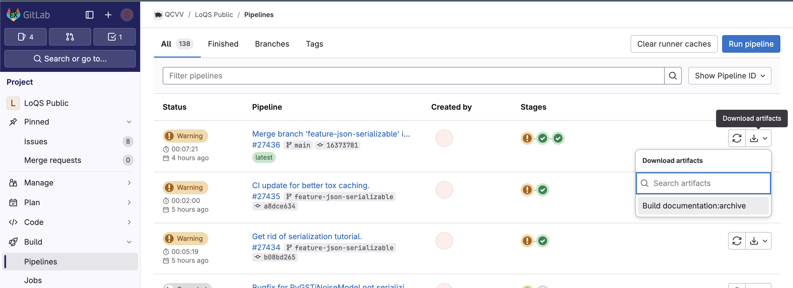

# LoQS (Public Release)


This repository is intended to be a sanitized version of the Logical Qubit Simulator (LoQS)
for eventual public release. Note that this repo is currently on CEE-GitLab only out of an
abundance of caution while porting things from LoQS. It is eventually intended to be public
on GitHub in the SandiaLabs organization.

## Installation

The following installation instructions can be used on M1/M2 Macs using Anaconda/Miniconda to create a local virtual environment.

```
conda create -p ./venv python=3.11
conda activate ./venv
pip install -e .
```

By default, this will not install any of the backends.
In order to install PyGSTi and QuantumSim (i.e. previous LoQS backends),
you can alter the last line to 

```
pip install -e ".[pygsti,quantumsim]"
```

There are various optional requirements that are available, including:

- `dask`: Enables usage of Dask for parallelizing over shots.
- `dev`: Allows the use of `black` and `flake8` prior to committing
(see Code Formatting and Linting below).
- `docs`: Allows building of the JupyterBook documentation (see Documentation below).
- `quantumsim`: Enables the QuantumSim backend.
- `pygsti`: Enables the PyGSTi backend.
- `test`: Allows testing (see Testing below)
- `visualization`: Enables some of the visualization tools in `loqs.tools`. Note that
  `pdflatex` is also required for full visualization support.

There are several helper "categories" for optional dependencies, including:

- `backends`: Packages needed to enable *all* backends
- `nobackends`: The complement of `backends`, i.e. all developer packages with no backends
(useful for testing)
- `all`: All optional dependencies

To use these, simply modify the last line of the installation instructions. For example:

```
pip install -e ".[all]"
```

(where the quotes are only needed if using zsh instead of bash).

For developers who may want an editable version of `pyGSTi`, you can run:

```
pip install -e git+https://github.com/sandialabs/pyGSTi.git@v0.9.12#egg=pyGSTi
```

to get the 0.9.12 release of pyGSTi, which will be located in `src`.
Alternatively, you can use any other tag or commit hash instead of `v0.9.12`
if you are working off of a feature branch.

### Visualization

LoQS now has some capability to turn circuit diagrams into LaTeX via the quantikz package.
This requires `pdflatex`, commonly from the a TeX installation, as well as `loqs[visualization]`.

## Documentation

This project uses JupyterBook for documentation.
Assuming the `docs` requirements have been installed, the documentation can be generated via:

```
jupyterbook build docs
```

and then viewed by opening `docs/_build/html/index.html` in a browser.

### Jupytext Notebooks

For users who want executable versions of the MyST Markdown can use Jupytext to turn them into IPython/Jupyter notebooks.
```
jupytext --sync docs/markdown/*
```

will synchronize all the Markdown files in `docs/markdown` with the Jupyter notebooks in `docs/notebook`. Only the 
Markdown is committed and used for generating the JupyterBook, but the notebooks can be handy to test execution
in an interactive way.

### GitLab Autobuilt Documentation

The documentation is built as part of the GitLab CI/CD Pipeline on every commit.
Unfortunately, GitLab-EX does not have Pages it seems, so we can't view this by URL easily.
However, it is straightforward to download the latest documentation.

1. Navigate to Build > Pipelines.
2. Find the latest Pipeline that has a green checkmark in the third circle (first is linting, second is unit tests, and third is building docs).
3. Go over to the arrow in a tray icon, which lets you download artifacts.
4. There should only be one artifact, which is for "Build documentation".
5. Click on it to download the file. Unzip it to a `public` folder, and then open `index.html` in your favorite web browser.
6. Profit! You now have the up-to-date docs.

