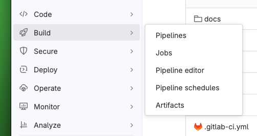
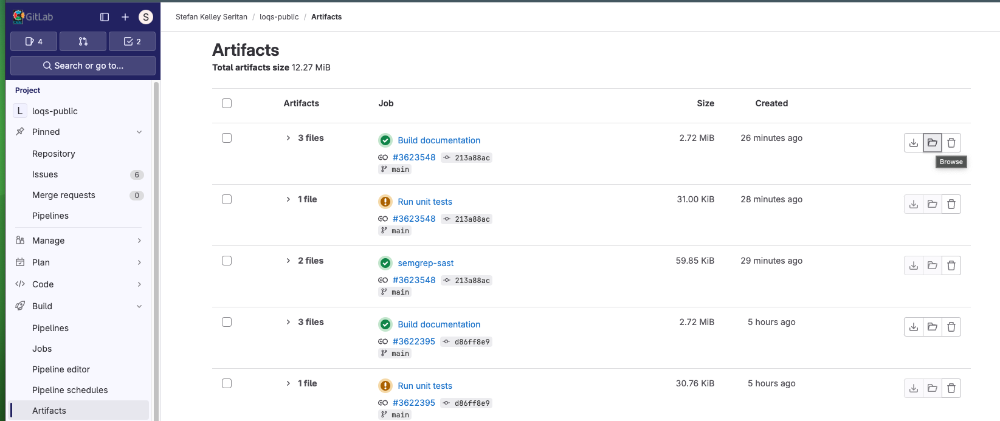
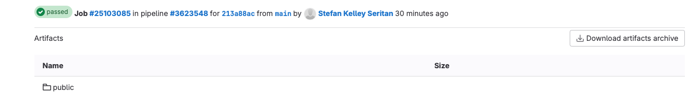
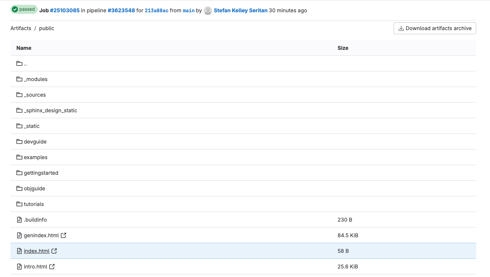
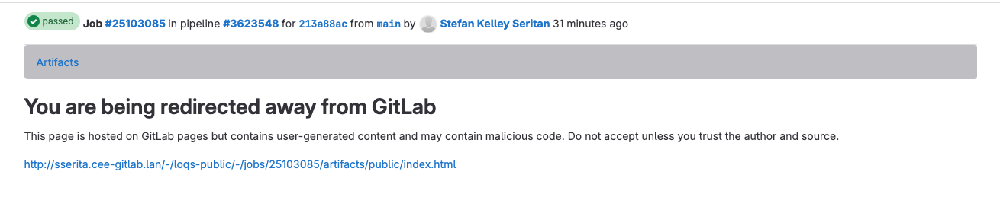
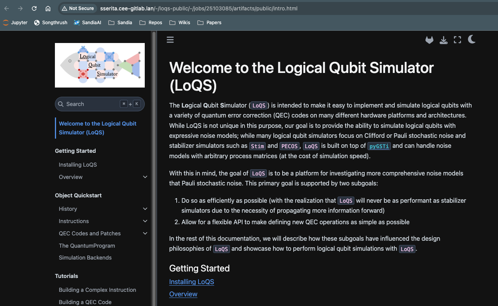

# LoQS (Public Release)

This repository is intended to be a sanitized version of the Logical Qubit Simulator (LoQS)
for eventual public release. Note that this repo is currently on CEE-GitLab only out of an
abundance of caution while porting things from LoQS. It is eventually intended to be public
on GitHub in the SandiaLabs organization.

## Installation

The following installation instructions can be used on M1/M2 Macs using Anaconda/Miniconda to create a local virtual environment.

```
conda create -p ./venv python=3.11
conda activate ./venv
pip install -e .
```

By default, this will not install any of the backends.
In order to install PyGSTi and QuantumSim (i.e. previous LoQS backends),
you can alter the last line to 

```
pip install -e ".[pygsti,quantumsim]"
```

There are various optional requirements that are available, including:

- `dev`: Allows the use of `black` and `flake8` prior to committing
(see Code Formatting and Linting below).
- `docs`: Allows building of the JupyterBook documentation (see Documentation below).
- `quantumsim`: Enables the QuantumSim backend.
- `pygsti`: Enables the PyGSTi backend.
- `test`: Allows testing (see Testing below)

There are several helper "categories" for optional dependencies, including:

- `backends`: Packages needed to enable *all* backends
- `nobackends`: The complement of `backends`, i.e. all developer packages with no backends
(useful for testing)
- `all`: All optional dependencies

To use these, simply modify the last line of the installation instructions. For example:

```
pip install -e ".[all]"
```

(where the quotes are only needed if using zsh instead of bash).

For developers who may want an editable version of `pyGSTi`, you can run:

```
pip install -e git+https://github.com/sandialabs/pyGSTi.git@v0.9.12#egg=pyGSTi
```

to get the 0.9.12 release of pyGSTi, which will be located in `src`.
Alternatively, you can use any other tag or commit hash instead of `v0.9.12`
if you are working off of a feature branch.

### Visualization

LoQS now has some capability to turn circuit diagrams into LaTeX via the quantikz package.
This requires several non-`pip` installable system packages:

- `pdflatex`, commonly from the a TeX installation
- `poppler`, which is used 

For Mac, consider install TeX and `poppler` through Homebrew.
On Linux, install through your package manager.

## Documentation

This project uses JupyterBook for documentation.
Assuming the `docs` requirements have been installed, the documentation can be generated via:

```
jupyterbook build docs
```

and then viewed by opening `docs/_build/html/index.html` in a browser.

### Jupytext Notebooks

For users who want executable versions of the MyST Markdown can use Jupytext to turn them into IPython/Jupyter notebooks.
For example,

```
jupytext --to ipynb docs/gettingstarted/workflow.md
```

will generate a corresponding `docs/gettingstarted/workflow.ipynb` file.
The Jupyter notebook and Markdown file can be synced up via

```
jupytext --sync docs/gettingstarted/workflow.md
```

for those who are maybe updating documentation and going back and forth between notebook and Markdown.

### GitLab Autobuilt Documentation

The documentation is built as part of the GitLab CI/CD Pipeline on every commit.
Eventually, this will be available at http://sserita.cee-gitlab.lan/loqs-public, but this link is currently broken due to unknown reasons.

However, one can still access the built artifact directly by following these steps:

1. Go to Build > Artifacts in the left hand menu.



2. Select "Browse" on the latest succeeding Build Documentation job.



3. Navigate to `public/index.html`.





4. Allow GitLab to redirect you to the CEE-Gitlab Pages domain (`cee-gitlab.lan`).



5. You are now viewing the most up-to-date version of the documentation!



Due to a CEE GitLab restriction, the notebook cells are not run;
however, this is still hopefully pretty useful for accessing the most up-to-date docs in your browser.