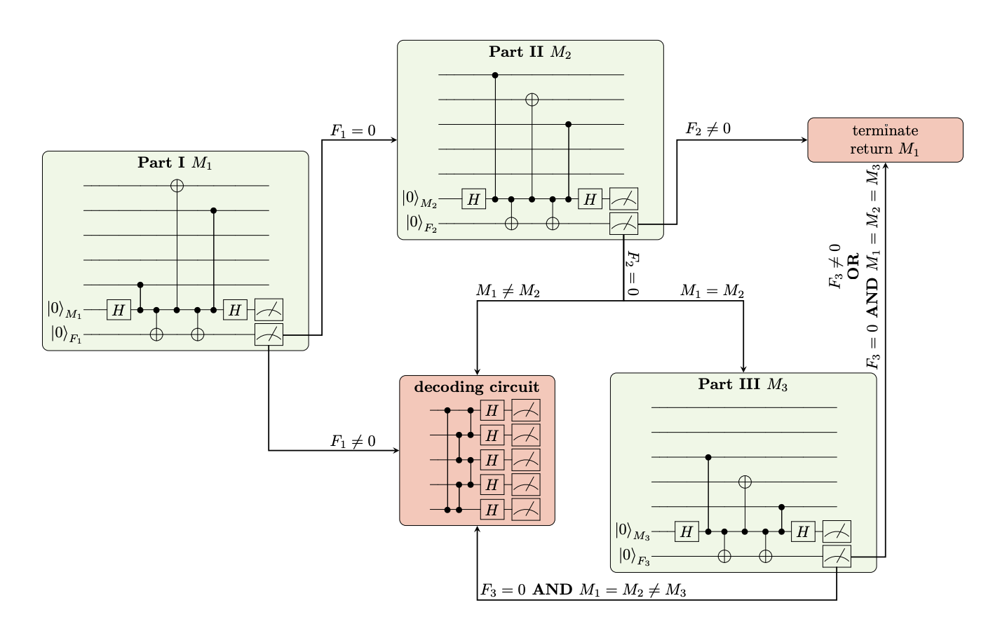

# Testing Fault Tolerance

Here we show a few examples of explicitly testing the fault tolerance of the [[5,1,3]] codepack.

```python {marimo disabled="true"}
from collections import Counter

from loqs.backends import QSimQuantumState, PyGSTiNoiseModel, PyGSTiPhysicalCircuit
from loqs.core import QuantumProgram, Frame, Instruction
from loqs.core.recordables import MeasurementOutcomes
from loqs.codepacks import codepack_5_1_3_quantinuum2022 as codepack_5_1_3
from loqs.tools.qsimtools import print_state_probs_phases
from loqs.tools import fttools
```

## Non-FT Program

Our starting point will be the non-FT program from the [Workflow tutorial](../markdown/workflow).

```python {marimo}
code_5q = codepack_5_1_3.create_qec_code(circuit_backend=PyGSTiPhysicalCircuit)

# Define the physical qubit labels for our system here
qubits = ["A0", "A1"] + [f"D{i+2}" for i in range(5)]

ideal_model = codepack_5_1_3.create_ideal_model(qubits, model_backend=PyGSTiNoiseModel)

state_type = QSimQuantumState
patch_types = {"5Q": code_5q}
```

```python {marimo}
# Stack
# The "Init *" instructions will be generated by the QuantumProgram based on the values
# of state_type and patch_types below
num_qubits = len(qubits)
stack = [
    ("Init State", None, (num_qubits,), {"qubit_labels": qubits}),
    ("Init Patch 5Q", None, ("L0", qubits)),
    ("Non-FT Minus Prep", "L0"),
    ("Non-FT Logical X Measure", "L0")
]

program = QuantumProgram(
    stack,
    default_noise_model=ideal_model,
    state_type=state_type,
    patch_types=patch_types,
    name="Prep minus, measure X"
)
```

```python {marimo}
# And now we can run it for real!
results = program.run(num_shots=10)

Counter(results.collect_shot_data("logical_measurement", -1))
```

## Sanity Check: Logical Minus Prep

While debugging, I found being able to print out the state in terms of the computational basis useful.
I've added this functionality to `loqs.internal.qsimtools`.

We can use this functionality to verify that the logical minus prep results in the correct state (given in comments, worked out by hand from the encoding circuit).

```python {marimo}
stack_prep_check = [
    ("Init State", None, (num_qubits,), {"qubit_labels": qubits}), # Autogenerated from state_type
    ("Init Patch 5Q", None, ("L0", qubits)), # Autogenerated from patch_types. Note that 5Q here must be a key into the patch_types dict below
    ("Non-FT Minus Prep", "L0"),
]

program_prep_check = QuantumProgram.from_quantum_program(program, stack_prep_check, name="Prep -")

results_prep_check = program_prep_check.run()

# Get the last shot history
last_shot_index = max(results_prep_check.shot_histories.keys())
hist = results_prep_check.shot_histories[last_shot_index]
final_state = hist[-1]["state"]
print_state_probs_phases(final_state)

# An equal superposition of all 0000000 -> 0011111 in lexographical order with phases:
# Starting at 0000000: +, +, +, -, +, +, -, +
# Starting at 0001000: +, +, +, -, -, -, +, -
# Starting at 0010000: +, -, +, +, +, -, -, -
# Starting at 0011000: -, +, -, -, +, -, -, -
# This appears correct, i.e. we are initializing logical - correctly
```

## Sanity Check: Stabilizers

Stabilizers should leave the state unchanged. So we should be able to do a non-FT prep, each stabilizer, and then a non-FT unprep and get all 0s out.

```python {marimo}
for stab in ['XZZXI', 'IXZZX', 'XIXZZ', 'ZXIXZ']:
    stack_stab = [('Init State', None, (num_qubits,), {'qubit_labels': qubits}), ('Init Patch 5Q', None, ('L0', qubits)), ('Non-FT Minus Prep', 'L0'), (f'{stab} Stabilizer', 'L0'), ('Non-FT Minus Unprep', 'L0')]
    program_stab = QuantumProgram.from_quantum_program(program, stack_stab, name=f'Prep -, Stab {stab}, Unprep -')  # Autogenerated from state_type
    results_stab = program_stab.run()  # Autogenerated from patch_types. Note that 5Q here must be a key into the patch_types dict below
    last_shot_index_1 = max(results_stab.shot_histories.keys())
    hist_1 = results_stab.shot_histories[last_shot_index_1]
    final_state_1 = hist_1[-1]['state']
    print(f'{stab} Probabilities')
    print_state_probs_phases(final_state_1)
    print()  # Get the last shot history
```

## Sanity Check: Stabilizer Checks

We can also check the check versions of the stabilizers (both unflagged and flagged).

```python {marimo}
for stab_1 in ['XZZXI', 'IXZZX', 'XIXZZ', 'ZXIXZ']:
    stack_stab_1 = [('Init State', None, (num_qubits,), {'qubit_labels': qubits}), ('Init Patch 5Q', None, ('L0', qubits)), ('Non-FT Minus Prep', 'L0'), (f'Unflagged {stab_1} Check', 'L0'), ('Non-FT Minus Unprep', 'L0')]
    program_stab_1 = QuantumProgram.from_quantum_program(program, stack_stab_1, name=f'Prep -, Stab {stab_1}, Unprep -')  # Autogenerated from state_type
    results_stab_1 = program_stab_1.run()  # Autogenerated from patch_types. Note that 5Q here must be a key into the patch_types dict below
    last_shot_index_2 = max(results_stab_1.shot_histories.keys())
    hist_2 = results_stab_1.shot_histories[last_shot_index_2]
    final_state_2 = hist_2[-1]['state']
    print(f'{stab_1} Check Probabilities')
    print_state_probs_phases(final_state_2)
    print()  # Get the last shot history
```

```python {marimo}
for stab_2 in ['XZZXI', 'IXZZX', 'XIXZZ', 'ZXIXZ']:
    stack_stab_2 = [('Init State', None, (num_qubits,), {'qubit_labels': qubits}), ('Init Patch 5Q', None, ('L0', qubits)), ('Non-FT Minus Prep', 'L0'), (f'Flagged {stab_2} Check', 'L0'), ('Non-FT Minus Unprep', 'L0')]
    program_stab_2 = QuantumProgram.from_quantum_program(program, stack_stab_2, name=f'Prep -, Stab {stab_2}, Unprep -')  # Autogenerated from state_type
    results_stab_2 = program_stab_2.run()  # Autogenerated from patch_types. Note that 5Q here must be a key into the patch_types dict below
    last_shot_index_3 = max(results_stab_2.shot_histories.keys())
    hist_3 = results_stab_2.shot_histories[last_shot_index_3]  # No feed-forward
    final_state_3 = hist_3[-1]['state']
    print(f'{stab_2} Check Probabilities')
    print_state_probs_phases(final_state_3)
    print()  # Get the last shot history
```

## FT Components with no Errors

```python {marimo}
stack_ft = [
    ("Init State", None, (num_qubits,), {"qubit_labels": qubits}), # Autogenerated from state_type
    ("Init Patch 5Q", None, ("L0", qubits)), # Autogenerated from patch_types. Note that 5Q here must be a key into the patch_types dict below
    ("FT Minus Prep", "L0"),
    ("Flagged QEC", "L0"),
    ("FT Logical X Measure", "L0")
]

program_ft = QuantumProgram.from_quantum_program(program, stack_ft, name="FT Prep -, measure X")

results_ft = program_ft.run(num_shots=10)

Counter(results_ft.collect_shot_data("logical_measurement", -1))
```

## FT Prep with Single Errors

We will test the repeat-unti-success FT prep here by inserting an X,Y,Z error at every circuit location.

```python {marimo}
stack_ftprep = [
    ("Init State", None, (num_qubits,), {"qubit_labels": qubits}), # Autogenerated from state_type
    ("Init Patch 5Q", None, ("L0", qubits)), # Autogenerated from patch_types. Note that 5Q here must be a key into the patch_types dict below
    ("FT Minus Prep", "L0"),
    ("FT Logical X Measure", "L0")
]

program_ftprep = QuantumProgram.from_quantum_program(program, stack_ftprep, name="FT Prep -, FT measure X")
```

```python {marimo}
# Let's try to use some of my new FT tools for this
# Get the first instruction from the FT Minus Prep instruction list
ft_minus_prep_instr = code_5q.instructions["FT Minus Prep"]
first_instr = ft_minus_prep_instr.data["instructions"][0]
noise_injected_programs = fttools.build_discrete_error_injection_programs(
    base_program=program_ftprep,
    instruction_to_analyze=first_instr,
    stack_idx_to_modify=2,
    error_circuit_labels=["Gxpi", "Gypi", "Gzpi"]
)
```

```python {marimo}
failed = fttools.run_discrete_error_injected_programs(
    noise_injected_programs,
    [("logical_measurement", -1)],
    [1],
)
```

## Adaptive FT Measure with Single Errors

Note that we are already using the FT measure above, and this is in fact catching some cases that would not trigger the RUS checks and would actually fail a non-FT measurement (e.g. a beginning X error on the middle data qubit).

So we know that this is working some of the time, but we can stress test this by inserting an XYZ error in every circuit location here.
Note that because of the feed-forward, this is actually more annoying than the previous case because some of the instructions are not available in the stack. We'll handle that later, but for Part I, we can use the same approach.

```python {marimo}
stack_ftmeas_partI = [
    ("Init State", None, (num_qubits,), {"qubit_labels": qubits}), # Autogenerated from state_type
    ("Init Patch 5Q", None, ("L0", qubits)), # Autogenerated from patch_types. Note that 5Q here must be a key into the patch_types dict below
    ("FT Minus Prep", "L0"),
    ("FT Logical X Measure Part I Circuit", "L0"),
    ("FT Logical X Measure Part I Feed-Forward", "L0"),
]

program_ftmeas_partI = QuantumProgram.from_quantum_program(program, stack_ftmeas_partI, name="FT Prep -, non-FT measure X")
```

```python {marimo}
# Let's try to use some of my new FT tools for this
# Get the first instruction from the FT Logical X Measure Part I Circuit instruction list
ft_meas_partI_instr = code_5q.instructions['FT Logical X Measure Part I Circuit']
first_instr_1 = ft_meas_partI_instr.data['instructions'][0]
noise_injected_programs_1 = fttools.build_discrete_error_injection_programs(base_program=program_ftmeas_partI, instruction_to_analyze=first_instr_1, stack_idx_to_modify=3, error_circuit_labels=['Gxpi', 'Gypi', 'Gzpi'])
```

```python {marimo}
failed_1 = fttools.run_discrete_error_injected_programs(noise_injected_programs_1, [('logical_measurement', -1)], [1])
```

Now we can circumvent the feed-forward by manually creating a stack with the later parts of the circuit as intended. However, because the later parts expect the part I feed forward frame for their processing, we will need to create a dummy instruction that outputs the expected frame.

```python {marimo}
def ideal_partI_apply_fn():
    return Frame({"F1": 0, "inferred_M1": 1})

ideal_partI = Instruction(
    ideal_partI_apply_fn,
    serialized_apply_fn="" # Hack, we won't need to serialize
)

stack_ftmeas_partII = [
    ("Init State", None, (num_qubits,), {"qubit_labels": qubits}), # Autogenerated from state_type
    ("Init Patch 5Q", None, ("L0", qubits)), # Autogenerated from patch_types. Note that 5Q here must be a key into the patch_types dict below
    ("FT Minus Prep", "L0"),
    ("FT Logical X Measure Part I Circuit", "L0"),
    ("Ideal Part I Feed-Forward", None), # Forward reference to global instruction
    ("FT Logical X Measure Part II Circuit", "L0"),
    ("FT Logical X Measure Part II Feed-Forward", "L0"),
]

program_ftmeas_partII = QuantumProgram.from_quantum_program(
    program,
    stack_ftmeas_partII,
    global_instructions={"Ideal Part I Feed-Forward": ideal_partI},
    name="FT Prep -, FT measure X"
)
```

```python {marimo}
# Let's try to use some of my new FT tools for this
# Get the first instruction from the FT Logical X Measure Part II Circuit instruction list
ft_meas_partII_instr = code_5q.instructions['FT Logical X Measure Part II Circuit']
first_instr_2 = ft_meas_partII_instr.data['instructions'][0]
noise_injected_programs_2 = fttools.build_discrete_error_injection_programs(base_program=program_ftmeas_partII, instruction_to_analyze=first_instr_2, stack_idx_to_modify=5, error_circuit_labels=['Gxpi', 'Gypi', 'Gzpi'])
```

```python {marimo}
failed_2 = fttools.run_discrete_error_injected_programs(noise_injected_programs_2, [('logical_measurement', -1)], [1])
```

And we can do the same thing for Part III, but we have to mock both feed forwards.

```python {marimo}
def ideal_partII_apply_fn():
    return Frame({"F2": 0, "inferred_M2": 1})

ideal_partII = Instruction(
    ideal_partII_apply_fn,
    serialized_apply_fn="" # Hack, we won't need to serialize
)

stack_ftmeas_partIII = [
    ("Init State", None, (num_qubits,), {"qubit_labels": qubits}), # Autogenerated from state_type
    ("Init Patch 5Q", None, ("L0", qubits)), # Autogenerated from patch_types. Note that 5Q here must be a key into the patch_types dict below
    ("FT Minus Prep", "L0"),
    ("FT Logical X Measure Part I Circuit", "L0"),
    ("Ideal Part I Feed-Forward", None), # Forward reference to global instruction
    ("FT Logical X Measure Part II Circuit", "L0"),
    ("Ideal Part II Feed-Forward", None), # Forward reference to global instruction
    ("FT Logical X Measure Part III Circuit", "L0"),
    ("FT Logical X Measure Part III Feed-Forward", "L0"),
]

program_ftmeas_partIII = QuantumProgram.from_quantum_program(
    program,
    stack_ftmeas_partIII,
    global_instructions={
        "Ideal Part I Feed-Forward": ideal_partI,
        "Ideal Part II Feed-Forward": ideal_partII
    },
    name="FT Prep -, FT measure X"
)
```

```python {marimo}
# Let's try to use some of my new FT tools for this
# Get the first instruction from the FT Logical X Measure Part III Circuit instruction list
ft_meas_partIII_instr = code_5q.instructions['FT Logical X Measure Part III Circuit']
first_instr_3 = ft_meas_partIII_instr.data['instructions'][0]
noise_injected_programs_3 = fttools.build_discrete_error_injection_programs(base_program=program_ftmeas_partIII, instruction_to_analyze=first_instr_3, stack_idx_to_modify=7, error_circuit_labels=['Gxpi', 'Gypi', 'Gzpi'])
```

```python {marimo}
failed_3 = fttools.run_discrete_error_injected_programs(noise_injected_programs_3, [('logical_measurement', -1)], [1])
```

## QEC with Single Errors

We've tested FT prep and measure. The last thing to test is the flagged QEC to ensure that it is also fault-tolerant. Like with the adaptive measure, we will have to mock some of these with the ideal case to test some of the workflow.

```python {marimo}
stack_ftqec1 = [('Init State', None, (num_qubits,), {'qubit_labels': qubits}), ('Init Patch 5Q', None, ('L0', qubits)), ('FT Minus Prep', 'L0'), ('Flagged XZZXI Check', 'L0'), ('Flagged XZZXI Feed-Forward', 'L0'), ('FT Logical X Measure', 'L0')]
program_ftqec1 = QuantumProgram.from_quantum_program(program, stack_ftqec1, name='FT Prep -, QEC, FT measure X')  # Autogenerated from state_type
flagged_xzzxi_instr = code_5q.instructions['Flagged XZZXI Check']  # Autogenerated from patch_types. Note that 5Q here must be a key into the patch_types dict below
first_instr_4 = flagged_xzzxi_instr.data['instructions'][0]
# Get the first instruction from the Flagged XZZXI Check instruction list
noise_injected_programs_4 = fttools.build_discrete_error_injection_programs(base_program=program_ftqec1, instruction_to_analyze=first_instr_4, stack_idx_to_modify=3, error_circuit_labels=['Gxpi', 'Gypi', 'Gzpi'])
```

Now we begin to mess with the flow of the feed-forward to get access to those operations for testing. The good news is that unlike adaptive measure, we don't rely on previous information. Successful feed-forward only sets the next flagged check to be run, so we can directly do that in the stack.

```python {marimo}
stack_ftqec2 = [('Init State', None, (num_qubits,), {'qubit_labels': qubits}), ('Init Patch 5Q', None, ('L0', qubits)), ('FT Minus Prep', 'L0'), ('Flagged IXZZX Check', 'L0'), ('Flagged IXZZX Feed-Forward', 'L0'), ('FT Logical X Measure', 'L0')]
program_ftqec2 = QuantumProgram.from_quantum_program(program, stack_ftqec2, name='FT Prep -, QEC, FT measure X')  # Autogenerated from state_type
flagged_ixzzx_instr = code_5q.instructions['Flagged IXZZX Check']  # Autogenerated from patch_types. Note that 5Q here must be a key into the patch_types dict below
first_instr_5 = flagged_ixzzx_instr.data['instructions'][0]
# Get the first instruction from the Flagged IXZZX Check instruction list
noise_injected_programs_5 = fttools.build_discrete_error_injection_programs(base_program=program_ftqec2, instruction_to_analyze=first_instr_5, stack_idx_to_modify=3, error_circuit_labels=['Gxpi', 'Gypi', 'Gzpi'])
```

```python {marimo unparsable="true"}
stack_ftqec3 = [
    ("Init State", None, (num_qubits,), {"qubit_labels": qubits}), # Autogenerated from state_type
    ("Init Patch 5Q", None, ("L0", qubits)), # Autogenerated from patch_types. Note that 5Q here must be a key into the patch_types dict below
    ("FT Minus Prep", "L0"),
    ("Flagged XIXZZ Check", "L0"),
    ("Flagged XIXZZ Feed-Forward", "L0"),
    ("FT Logical X Measure", "L0")
]

program_ftqec3 = QuantumProgram.from_quantum_program(
    program,
    stack_ftqec3,
    name="FT Prep -, QEC, FT measure X"
)

noise_injected_programs = fttools.build_discrete_error_injection_programs(
    base_program=program_ftqec3,
    # Get the first instruction from the Flagged XIXZZ Check instruction list
    flagged_xixzz_instr = code_5q.instructions["Flagged XIXZZ Check"],
    first_instr = flagged_xixzz_instr.data["instructions"][0],
    instruction_to_analyze=first_instr,
    stack_idx_to_modify=3,
    error_circuit_labels=["Gxpi", "Gypi", "Gzpi"]
)
```

```python {marimo}
stack_ftqec4 = [('Init State', None, (num_qubits,), {'qubit_labels': qubits}), ('Init Patch 5Q', None, ('L0', qubits)), ('FT Minus Prep', 'L0'), ('Flagged ZXIXZ Check', 'L0'), ('Flagged ZXIXZ Feed-Forward', 'L0'), ('FT Logical X Measure', 'L0')]
program_ftqec4 = QuantumProgram.from_quantum_program(program, stack_ftqec4, name='FT Prep -, QEC, FT measure X')  # Autogenerated from state_type
flagged_zxixz_instr = code_5q.instructions['Flagged ZXIXZ Check']  # Autogenerated from patch_types. Note that 5Q here must be a key into the patch_types dict below
first_instr_6 = flagged_zxixz_instr.data['instructions'][0]
# Get the first instruction from the Flagged ZXIXZ Check instruction list
noise_injected_programs_6 = fttools.build_discrete_error_injection_programs(base_program=program_ftqec4, instruction_to_analyze=first_instr_6, stack_idx_to_modify=3, error_circuit_labels=['Gxpi', 'Gypi', 'Gzpi'])
```

## More In-Depth Testing

Seeing all the programs succeed above, one might wonder whether the testing is implemented correctly, or if it just always says things pass. To ensure that is not the case, we'll manually test several interesting injected errors and ensure that the correct syndromes are observed, decoding happens appropriately, and feed-forward logic proceeds as expected.

It would be a lot of effort to do this exhaustively, but we can at least highlight a few interesting examples.
<!---->
### In-Depth FT Prep

First, we'll test the FT prep. Recall the FT $\ket{-}$ prep circuit is as follows:


Let's insert an X error on data qubit 3 after the first CZ gate. This will spread to data qubit 2 as a Z error. The first $\bar{X}$ check is not sensitive to this. The second $\bar{X}$ actually does pick up on the errors, but it picks up on both of them, leaving the overall syndrome check untriggered. Thankfully, the last $\bar{X}$ does catch it. Thus, we expect to see measurement outcomes of [0, 0, 1] on the syndrome qubit and [0, 0, 0] on the flag qubit. This should in turn trigger a second round of the RUS instruction, which this time will be successful.

```python {marimo}
stack_ftprep_D3X_error = [
    ("Init State", None, (num_qubits,), {"qubit_labels": qubits}),
    ("Init Patch 5Q", None, ("L0", qubits)),
    # Here we inject an X error before layer 2, i.e. between CZs, on qubit 4 (0-indexed, and our qubit convention is 2 aux + 5 data)
    ("FT Minus Prep", "L0", (), {"error_injections": [(2, "Gxpi", 4)]}),
    ("FT Logical X Measure", "L0")
]

program_ftprep_D3X_error = QuantumProgram.from_quantum_program(program, stack_ftprep_D3X_error)

program_ftprep_D3X_error.run()
```

```python {marimo}
# We can interactively look to see that this is indeed what happened...
program_ftprep_D3X_error.display()
```

```python {marimo}
# ... or we can programmatically test some of the shot features (more than just logical measurement)
fttools.test_program_output(
    program_ftprep_D3X_error,
    collect_shot_data_args=[
        ("inferred_outcomes", 2), # Let's grab the outcomes for the first round of RUS
        ("rus_success", 2),       # And also the computed RUS success value
        ("inferred_outcomes", 4), # Let's do it again for the second round (frame 3 is the reset)
        ("rus_success", 4),       
        ("logical_measurement", -1) # And still check the logical outcome
    ],
    expected_outcomes=[
        MeasurementOutcomes({"A0": [0, 0, 1], "A1": [0, 0, 0]}),
        False,
        MeasurementOutcomes({"A0": [0, 0, 0], "A1": [0, 0, 0]}),
        True,
        1
    ])
```

### In-Depth Adaptive Measure

Next, we'll test the FT measure. Recall that the workflow for the adaptive measure is as follows:



In this case, we'll want to insert multiple errors that trigger different feed-forward conditions.

Let's start simple: We can inject a data error on the first layer that will trip Part I syndrome but not Part II syndrome, or vice-versa. This should lead us then to to the decoding circuit, where we classically decode the data error and return the correct logical outcome. One such error is a Z error on data qubit 2, which will trip Part II but not Part I.

```python {marimo}
stack_ftmeas_partI_D2Z_error = [
    ("Init State", None, (num_qubits,), {"qubit_labels": qubits}),
    ("Init Patch 5Q", None, ("L0", qubits)),
    ("FT Minus Prep", "L0"),
    # Insert at layer 0, a Z error, on qubit 3 (0-indexed, where first 2 are aux qubits)
    ("FT Logical X Measure Part I Circuit", "L0", (), {"error_injections": [(0, "Gzpi", 3)]}),
    ("FT Logical X Measure Part I Feed-Forward", "L0"),
]

program_ftmeas_partI_D2Z_error = QuantumProgram.from_quantum_program(program, stack_ftmeas_partI_D2Z_error)

program_ftmeas_partI_D2Z_error.run()
```

```python {marimo}
program_ftmeas_partI_D2Z_error.display()
```

```python {marimo}
fttools.test_program_output(
    program_ftmeas_partI_D2Z_error,
    collect_shot_data_args=[
        ("log", 3),                # Double-check this is the Part I circuit result
        ("measurement_outcomes", 3),  # This should be all 0
        ("log", 4),                # Double-check this is the Part I feed-forward result
        ("F1", 4),                 # Should have no flag
        ("inferred_M1", 4),        # and this should have correctly identified logical 1 measurement
        ("log", 5),                # Double-check this is the Part II circuit result
        ("measurement_outcomes", 5),  # Now syndrome should be tripped
        ("log", 6),                # Double-check this is the Part II feed-forward result
        ("F2", 6),                 # Should have no flag
        ("inferred_M2", 6),        # but incorrectly identify logical 0 measurement
        ("log", 7),                # We should now hit decoder circuit
        ("measurement_outcomes", 7), # The Z error should show up as a bitflip on data qubit 2
        ("log", 8),                # Finally we hit the classical decoder
        ("classical_correction", 8), # Let's see that the decoder picked out the correct error...
        ("corrected_outcomes", 8), # ... and applied the correction properly
        ("logical_measurement", 8) # And still check the logical outcome
    ],
    expected_outcomes=[
        "FT Logical X Measure Part I Circuit result",
        MeasurementOutcomes({"A0": [0], "A1": [0]}),
        "FT Logical X Measure Part I Feed-Forward result",
        0,
        1,
        "FT Logical X Measure Part II Circuit result",
        MeasurementOutcomes({"A0": [1], "A1": [0]}),
        "FT Logical X Measure Part II Feed-Forward result",
        0,
        0,
        "Non-FT state decoder circuit result",
        MeasurementOutcomes({"D2": [0], "D3": [1], "D4": [0], "D5": [0], "D6": [0]}),
        "FT Logical X Measure Classical Decoder result",
        "IXIII", # Remember that this is the decoded error
        [0, 0, 0, 0, 0],
        1
    ], verbose=True)
```

Now let's also test one of those hook errors that flagged FT is supposed to be helping us with. Specifically, let's insert an X error on the syndrome qubit just before the CX check. This will create a weight-2 hook error (XZIII), which should push us straight to the decoding circuit. This time, the lookup table should not be the weight-1 errors we use for decoding data errors, but instead be based on the hook errors of our XZIIZ check. We should still be able to correct back though.

```python {marimo}
stack_ftmeas_partI_M1X_error = [
    ("Init State", None, (num_qubits,), {"qubit_labels": qubits}),
    ("Init Patch 5Q", None, ("L0", qubits)),
    ("FT Minus Prep", "L0"),
    # Insert at layer 3, a X error, on qubit 0 (0-indexed, where first qubit is measure qubit)
    ("FT Logical X Measure Part I Circuit", "L0", (), {"error_injections": [(3, "Gxpi", 0)]}),
    ("FT Logical X Measure Part I Feed-Forward", "L0"),
]

program_ftmeas_partI_M1X_error = QuantumProgram.from_quantum_program(program, stack_ftmeas_partI_M1X_error)

program_ftmeas_partI_M1X_error.run()
```

```python {marimo}
program_ftmeas_partI_M1X_error.display()
```

```python {marimo}
fttools.test_program_output(
    program_ftmeas_partI_M1X_error,
    collect_shot_data_args=[
        ("log", 3),                # Double-check this is the Part I circuit result
        ("measurement_outcomes", 3),  # An X error is undetectable on measure, but it should trip the flag!
        ("log", 4),                # Double-check this is the Part I feed-forward result
        ("F1", 4),                 # We should have a flag...
        ("inferred_M1", 4),        # ... but still think this is logical 1
        ("log", 5),                # We should now hit decoder circuit
        # The expected measurement outcome is non-trivial.
        # The X error on data qubit 1 will prop to Z errors on data qubit 2 and 5
        # This will cancel the Z error on data qubit 2, but show up as a bitflip on data qubit 5
        ("measurement_outcomes", 5),
        ("log", 6),                # Finally we hit the classical decoder
        ("classical_correction", 6), # Let's see that the decoder picked out the correct error...
        ("corrected_outcomes", 6), # ... and applied the correction properly
        ("logical_measurement", 6) # And still check the logical outcome
    ],
    expected_outcomes=[
        "FT Logical X Measure Part I Circuit result",
        MeasurementOutcomes({"A0": [0], "A1": [1]}),
        "FT Logical X Measure Part I Feed-Forward result",
        1,
        1,
        "Non-FT state decoder circuit result",
        MeasurementOutcomes({"D2": [0], "D3": [0], "D4": [0], "D5": [0], "D6": [1]}),
        "FT Logical X Measure Classical Decoder result",
        "IIIIX", # Remember that this is the decoded error
        [0, 0, 0, 0, 0],
        1
    ], verbose=True)
```