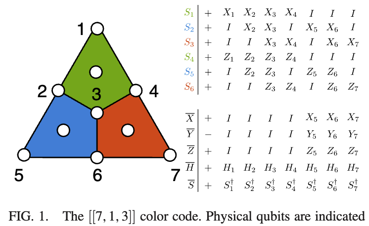
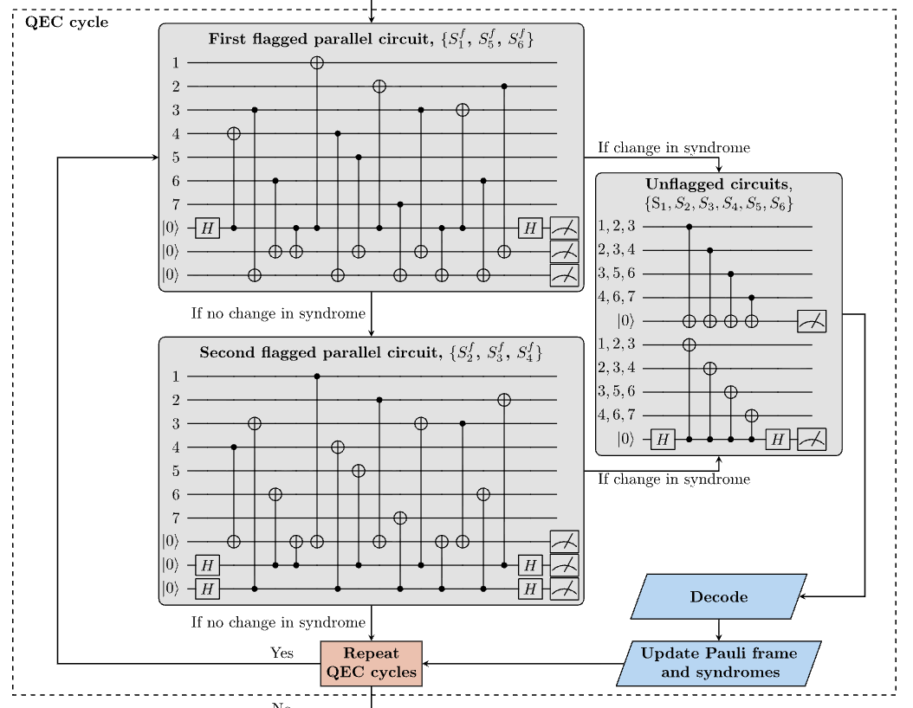
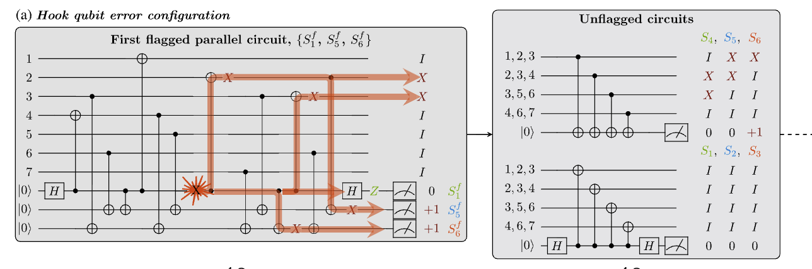

---
jupytext:
  text_representation:
    extension: .md
    format_name: myst
    format_version: 0.13
    jupytext_version: 1.19.1
kernelspec:
  display_name: Python 3 (ipykernel)
  language: python
  name: python3
---

# Instruction-specific Noise and Error Injection

[](https://mybinder.org/v2/gh/sandialabs/LoQS/{{ binder_branch }}?filepath=docs/notebooks/shortcourse-targetednoise.ipynb)

The previous notebook let us change the noise model for the whole program. However, sometimes we want to make more targeted changes: insert a Pauli at a specific location in a circuit, or swap out the noise model for one particular Instruction.

These are possible, but require digging deeper into the codepacks and manipulating the Instructions themselves.

## Anatomy of an Instruction

Instructions are intended to be extremely general ways to tell LoQS to do something. They are essentially user-written functions bundled up with a few pieces of functionality that let LoQS map it onto the physical qubits and route data into/out of the function.

A few essential components of an Instruction:

- `apply_fn`: This is the actual function that gets applied when the Instruction is run.
- `data`: This is a dictionary of information that the Instruction needs that will not be provided by the QuantumProgram or any previous Frames.
For example: Physical circuit Instructions have a `circuit` that describes the circuit. This is something the Instruction knows/needs but nothing else in the program needs. These are not hard-coded into the `apply_fn` because...
- `map_qubits_fn`: This is a secondary user-written function that tells LoQS how to modify any qubit labels in `data`. This is so that we can write the Instruction once, but then have it be applied to arbitrary patches (i.e. different qubit labels). In our previous example, physical circuit Instructions would need a `map_qubits_fn` that at least maps qubit labels on the `circuit` inside `data`.
You can think of the base Instruction as a template, which LoQS then fills in with qubit information from the QECCodePatch at runtime.

### Deeper Dive on Physical Circuit Instructions

All "standard" Instructions can be created using the builders in `loqs.core.instructions.builders`.

Let's take a look at the physical circuit instruction builder docstring (also accessible in built docs, but shown here for completeness):

```{code-cell} ipython3
import loqs.core.instructions.builders as ib

print(ib.build_physical_circuit_instruction.__doc__)
```

There's a lot of information here (hopefully)! In particular, it contains information on the input parameters of the `apply_fn` as well as what will be generally available (but not necessarily exhaustive) in the resulting Frame.

Key things for us to focus on for this tutorial:
- `model`: The docstring notes that this is usually taken from the program, but can come from the Instruction's `data` or the `InstructionLabel` (more on that soon)
- `error_injections`: The docstring notes that this parameter exists. We'll cover how to use it below.

There are other useful things in here for those who want to customize their physical circuit Instructions, but that's outside the scope of this tutorial.

## Instruction-specific Noise

Let's start with the "higher level" modification first: It is possible to override the noise model (and other parameters) for a specific Instruction.

For example, consider we have the following QuantumProgram:

```{code-cell} ipython3
from loqs.codepacks import codepack_7_1_3_quantinuum2021 as codepack_Steane
from loqs.core import Frame, History, InstructionStack, PatchLayout, QuantumProgram
from loqs.backends import NumpyStatevectorQuantumState, PyGSTiNoiseModel

# Let's define qubits for a single Quantinuum-style Steane patch: 7 data qubits, 3 aux qubits
qubits = ["A0", "A1", "A2"] + [f"D{i}" for i in range(7)]

ideal_model = codepack_Steane.create_ideal_model(qubits=qubits)

steane_code = codepack_Steane.create_qec_code()

init_state = NumpyStatevectorQuantumState(10, qubit_labels=qubits)
init_patches = PatchLayout({"L0": steane_code.create_patch(qubits=qubits)})
init_frame = Frame({"state": init_state, "patches": init_patches})
init_history = History(init_frame)

stack1 = InstructionStack([
    ("FT Zero Prep", "L0"),
    ("I", "L0"),
    ("Adaptive QEC", "L0"),
    ("FT Logical Z Measure", "L0")
])

program1 = QuantumProgram(stack1, init_history, default_noise_model=ideal_model, name="Perfect idle program")

# Quick sanity check:
program1.run(100).collect_shot_data("logical_measurement", -1, return_counter=True)
```

Now, let's assume that we want to simulate a case where the logical idle is super long, and therefore we expect a different noise model to apply for that particular step.

Let's check what the actual circuit is, so that we know which *physical* operations need to be adjusted:

```{code-cell} ipython3
print(steane_code.instructions["I"])
```

We see that this instruction is just Gi on the data qubits. Let's tweak the noise model to add some depolarizing noise on Gi.

We could build a full noise model from scratch like in the previous tutorial, but we can also make spot changes since we know how implicit models work in pyGSTi.

```{code-cell} ipython3
depol_Gi_model_pygsti = ideal_model.model.copy()

# These are the gates that are used when constructing layers
depol_Gi_model_pygsti.operation_blks["gates"]
```

```{code-cell} ipython3
# Replace the Gi gate and pre-computed layers
import pygsti.modelmembers.operations as ops

ideal_Gi = depol_Gi_model_pygsti.operation_blks["gates"]["Gi"]

# Make a depolarizing channel (not a unique way to do this)
# Note that lindblad coeffs do not directly equal depolarizing rates
# Mini Exercise: Derive the relations between Kraus coeffs, PTM entries, and errgen coeffs for a depolarizing channel
depol_errgen = ops.LindbladErrorgen.from_elementary_errorgens({("S", "X"): 0.01, ("S", "Y"): 0.01, ("S", "Z"): 0.01}, state_space=ideal_Gi.state_space)
depol_Gi = ops.ExpErrorgenOp(depol_errgen)

# To patch this in, we need to adjust both the gates and layers (embedded ops into the full space)
depol_Gi_model_pygsti.operation_blks["gates"]["Gi"] = depol_Gi

for q in depol_Gi_model_pygsti.state_space.qubit_labels:
    depol_Gi_model_pygsti.operation_blks["layers"]["Gi", q].embedded_op = depol_Gi

# And finally, wrap it back up in a LoQS model
depol_Gi_model = PyGSTiNoiseModel(depol_Gi_model_pygsti, qubits)

# Minor hack for today: Force the model to use Kraus rep
from loqs.backends import KrausGateRep
depol_Gi_model._output_gate_reps = [KrausGateRep]
```

With our adjusted model, we can now pipe this in to our Instruction.
We have two options: We could store the model in the Instruction.data, so that every I we see has this applied. Alternatively, we can do a one-time override by adjusting the InstructionLabel.

### New Instruction that always depolarizes

```{code-cell} ipython3
# Option 1: Making every I instruction use this noise model
depol_I = steane_code.instructions["I"].copy()
depol_I.data["model"] = depol_Gi_model

# We can print out the instruction
# You should see that now model is in the Data block, pointing to a pyGSTi model
print(depol_I)

# And finally, add it back into the QECCode
steane_code.instructions["I (depolarized)"] = depol_I
```

```{code-cell} ipython3
# BUG: Still slow here if running I after running I (depolarized)

# Finally, we can make a new stack
# (Because the patch dict holds the QECCode by reference, we don't need to adjust the initial History, it should get our update automatically)
stack2 = InstructionStack([
    ("FT Zero Prep", "L0"),
    ("I", "L0"),
   # ("I (depolarized)", "L0"),
    ("Adaptive QEC", "L0"),
    ("FT Logical Z Measure", "L0")
])

program2 = QuantumProgram.from_quantum_program(program1, stack2)#, default_base_seed=1234, name="All I's depolarized")

# Quick sanity check:
program2.run(100).collect_shot_data("logical_measurement", -1, return_counter=True)
```

### Change single Instruction with depolarizing model

Instead of creating a new Instruction, we can just pass the model in to the Instruction's apply_fn at runtime.

We can do this by using the (so far unused) extra keys of an InstructionLabel. An InstructionLabel is a dict with an `"instruction"` key plus any number of extra keyword arguments, e.g. `{"instruction": ..., "patch_label": ..., **apply_fn_kwargs}`; any extra keys are passed straight through to the Instruction's apply_fn as kwargs.

So this approach would look like:

```{code-cell} ipython3
# Make a new stack with spot change
stack3 = InstructionStack([
    ("FT Zero Prep", "L0"),
    ("I", "L0"),
    {"instruction": "I", "patch_label": "L0", "model": depol_Gi_model}, # model override as a kwarg, just for this one instruction
    ("Adaptive QEC", "L0"),
    ("FT Logical Z Measure", "L0")
])

# If we use the same base seed as before, we should get exactly the same results
program3 = QuantumProgram.from_quantum_program(program2, stack3, name="Single I depolarized")

program3.run(100).collect_shot_data("logical_measurement", -1, return_counter=True)
```

## Exercise 1

#### Instead of a depolarizing noise on an idle gate, make a program for the |1>/Z state preservation test where only the first X layer after the FT prep has some overrotation error.

It's a bit contrived, but this could be a real model if there was some sort of serial context dependency where the first gates after the FT prep were noisier than the rest of the circuit.

<details>
<summary>Hint 1</summary>
We are going to be modifying the Gxpi entries of the model rather than Gi. We *could* create an operation from scratch to do this, but we have options in pyGSTi to just add on noise, i.e. the ComposedOp:

```
ideal_Gx = depol_Gi_model_pygsti.operation_blks["gates"]["Gxpi"]

Xoverrot_errgen = ops.LindbladErrorgen.from_elementary_errorgens({("H", "X"): 0.01}, state_space=ideal_Gi.state_space)
Xoverrot_Gxpi = ops.ComposedOp([ideal_Gx, ops.ExpErrorgenOp(depol_errgen)])
```

</details>

---
<details>
<summary>Solution</summary>

Because we only want one Instruction to have a different model, we need to use Option 2, i.e. pass in by the InstructionLabel.

First we create our model, where we adjust the Gxpi gates as per Hint 1.
```
ideal_Gx = depol_Gi_model_pygsti.operation_blks["gates"]["Gxpi"]

Xoverrot_errgen = ops.LindbladErrorgen.from_elementary_errorgens({("H", "X"): 0.01}, state_space=ideal_Gi.state_space)
Xoverrot_Gxpi = ops.ComposedOp([ideal_Gx, ops.ExpErrorgenOp(depol_errgen)])

overrot_Gx_model_pygsti.operation_blks["gates"]["Gxpi"] = Xoverrot_Gxpi
for q in overrot_Gx_model_pygsti.state_space.qubit_labels:
    overrot_Gx_model_pygsti.operation_blks["layers"]["Gxpi", q].embedded_op = Xoverrot_Gxpi

# And finally, wrap it back up in a LoQS model
overrot_Gx_model = PyGSTiNoiseModel(overrot_Gx_model_pygsti, qubits)
```

Then we use the following stack:

```
stack = InstructionStack([
    ("FT Zero Prep", "L0"),
    {"instruction": "X", "patch_label": "L0", "model": overrot_Gx_model},
    ("Adaptive QEC", "L0"),
    ("FT Logical Z Measure", "L0")
])
```

</details>

## Error Injection

The above is all nice and dandy if we want an entire instruction to have a specific noise model (which by the way is basically how LoQS can simulate the code capacity model).

But what if you want to inject a bitflip error at a particular point in the circuit to see how the QEC circuit operates?

#### Question: You can actually already do this using what we talked about above. How would you do so?

<details>
<summary>Answer</summary>

You would copy out the circuit from the Instruction's `data`, modify it, and then pass that in via a kwarg `circuit` override in the InstructionLabel.

</details>

---

But there is an even more convenient interface for this if we recall that the physical circuit instruction takes an `error_injections` argument.

In order to use this properly though, we have to understand the details of our circuit.

Reproduced Fig 1 From PRX 11, 041058 2021



Partial Reproduction of Fig 10 from same paper



You also have to know how the Adaptive QEC instruction works, which will be our first introduction to feed-forward Instructions.

Visualization in progress, but the workflow is as follows:

- (1) Flagged Parallel S1-S5-S6 Check (i.e. top green box)
- (2) Flagged S1-S5-S6 Feed-Forward (arrows coming out of top green box)
    - (2a) If no change, proceed to Flagged Parallel S2-S3-S4 Check and Flagged S2-S3-S4 Feed-Forward
    - (2b) If change, proceed to Unflagged Parallel S1-S2-S3 Check, Unflagged Parallel S4-S5-S6 Check, and QEC Decoder. Then Done.
- (3) If change after (2a), proceed to (2b)

The Adaptive QEC instruction is actually just a composite instruction of steps (1) and (2). That means the following two stacks are equivalent:

```{code-cell} ipython3
stack4 = InstructionStack([
    ("FT Zero Prep", "L0"),
    ("Adaptive QEC", "L0"),
    ("FT Logical Z Measure", "L0")
])

# Same as

stack5 = InstructionStack([
    ("FT Zero Prep", "L0"),
    ("Flagged Parallel S1-S5-S6 Check", "L0"),
    ("Flagged S1-S5-S6 Feed-Forward", "L0"),
    ("FT Logical Z Measure", "L0")
])
```

With that in mind, let's inject an error into Flagged Parallel S1-S5-S6 and make sure the feed-forward is working properly.
Here is the circuit:

```{code-cell} ipython3
print(steane_code.instructions["Flagged Parallel S1-S5-S6 Check"])
```

Let's say we want to insert the error shown in Fig 11a.

Partial Reproduction of Fig 11 from same paper



The syntax for error injections is `(layer, label, qubit index)`.

It turns out for our implementation of this circuit, this location would be at layer 4.

So this error injection would be (4, "Gxpi", qubits.index("A0")).

```{code-cell} ipython3
# Regular program but with X injected during first flagged checks
stack6 = InstructionStack([
    ("FT Zero Prep", "L0"),
    {"instruction": "Flagged Parallel S1-S5-S6 Check", "patch_label": "L0", "error_injections": [(4, "Gxpi", qubits.index("A0"))]},
    ("Flagged S1-S5-S6 Feed-Forward", "L0"),
    ("FT Logical Z Measure", "L0")
])

program6 = QuantumProgram.from_quantum_program(program1, stack6, name="Error injected")

results6 = program6.run() # Only a single shot, this is deterministic

# It was at this point that Stefan realized he had a bug in the Steane decoder.
# For now, we'll skip this exercise and come back to it when the bug is fixed.

#print(results6.collect_shot_data("logical_measurement", -1))

# One thing we can show though is the errored_circuit.
# We can also show off a slightly different way to get data out of shots
shot1 = results6.shot_histories[0]
print(shot1.collect_data("errored_circuit", "all", strip_none_entries=True)[0])
```

Ok, but we expected this to be correctable. So how do we know it actually did the right thing?

For the first time, let's print the entire shot history. This is EXTREMELY verbose, but it also contains a ton of information that is useful for tracking these sorts of things through the (dynamic) program execution.

## Guided Exercise

1. Print the shot history as below. Scroll down to the Frame Flagged S1-S5-S6 Check result and look at the `errored_circuit`. Is this the expected circuit with our injected error?
2. In that same frame, look at the measurement_outcomes. Is this the expected result?
2. The next frame is the result of the feed-forward. Look at the output `stack`. Are the next operations what you expected?

```{code-cell} ipython3
#print(results6.shot_histories[0])
```

```{code-cell} ipython3

```
