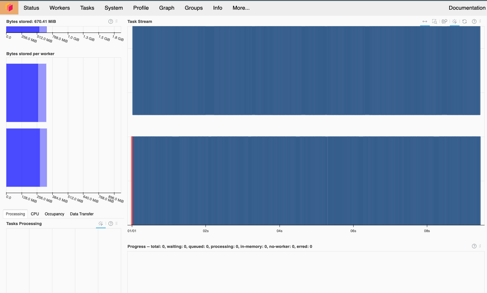
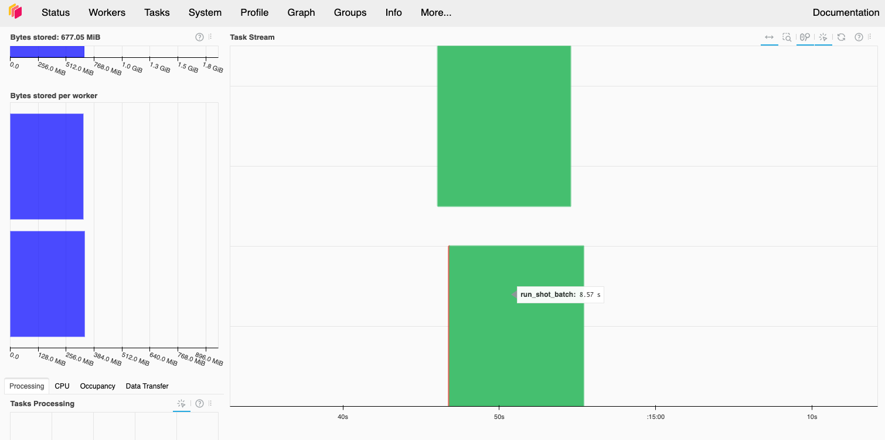
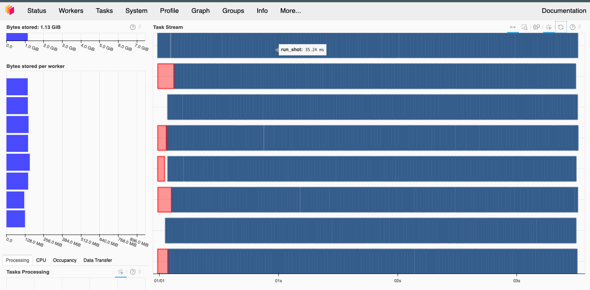
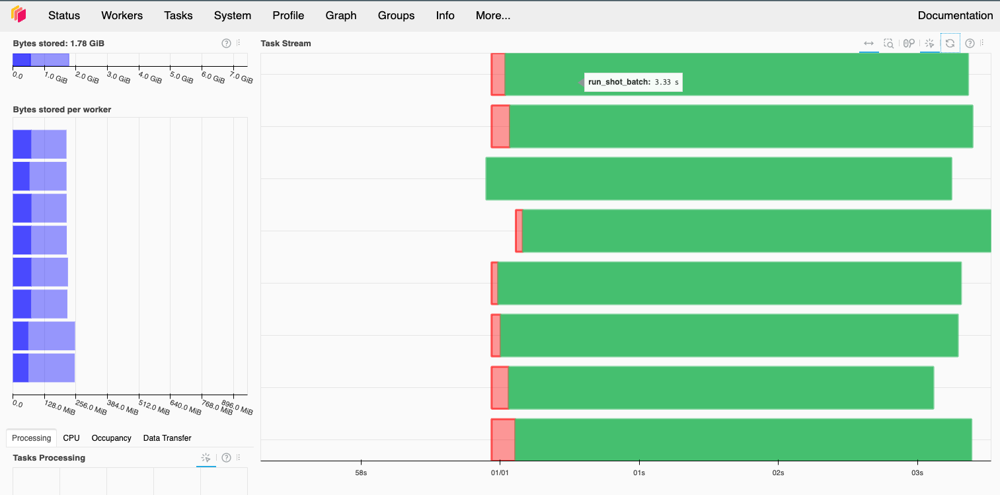

---
jupytext:
  text_representation:
    extension: .md
    format_name: myst
    format_version: 0.13
    jupytext_version: 1.16.1
kernelspec:
  display_name: Python 3
  language: python
  name: python3
---

# Parallelizing Programs with Dask

The short examples shown in these tutorials are simple enough to run on a laptop for demonstrative purposes.
But real usage of `LoQS` may have larger codes with more expensive forward simulation, more circuits (e.g. logical characterization protocols), and many more shots required for higher precision.
In that context, it is useful to try and parallelize program execution.

Thankfully, it is simple enough to parallelize over shots (either for a single `QuantumProgram` or a collection of them).
We choose to use Dask to do this, as it can handle both single workstation and multi-node HPC environments equally well.

Below, we show how parallelize program execution using Dask.

```{attention}
Parallelism is currently under development. While the current strategy does appear to scale reasonably, there may still be considerable scheduling/data communication overheads that have not been completely ironed out.
```

```{warning}
Many backends rely on `NumPy`, which will helpfully try to automatically parallelize under the hood. This needs to be controlled by setting various threading environment variables to a max limit of 1 prior to importing `numpy`.
```

```{warning}
Using `pyGSTi` and Dask together currently requires a specific branch (`bugfix-guard-signal`) of `pyGSTi` and setting the environment variable `"PYGSTI_NO_CUSTOMLM_SIGINT"`.
```

```{code-cell} ipython3
# DO THIS BEFORE NUMPY AND PYGSTI IMPORTS

import os
# We need to set this flag to make pyGSTi work with Dask
# Value does not matter, so long as it is set
os.environ["PYGSTI_NO_CUSTOMLM_SIGINT"] = "1"

# We also want to set openblas/openmp/mkl to one thread,
# we will control parallelism ourselves
os.environ['OPENBLAS_NUM_THREADS'] = '1'
os.environ['GOTO_NUM_THREADS'] = '1'
os.environ['OMP_NUM_THREADS'] = '1'
os.environ['NUMEXPR_NUM_THREADS'] = '1'
os.environ['VECLIB_MAXIMUM_THREADS'] = '1'
os.environ['MKL_NUM_THREADS'] = '1'
```

```{code-cell} ipython3
---
tags: [skip-exception]
---
from collections import Counter
import numpy as np

# Installed via loqs[dask] or loqs[all]
from dask.distributed import Client

from loqs.backends import QSimQuantumState, PyGSTiNoiseModel, PyGSTiPhysicalCircuit
from loqs.core import QuantumProgram
from loqs.codepacks import codepack_5_1_3_quantinuum2022 as codepack_5_1_3
```

## Launching a LocalCluster with Dask

While there are many ways to launch a LocalCluster on a single machine with Dask, perhaps the easiest is to just ask for a `Client` and let Dask launch the cluster for you in the background.
We can set many worker options from the client directly, like number of workers, the address of the Dask dashboard, and memory limits.

```{code-cell} ipython3
---
tags: [skip-exception]
---
client = Client(n_workers = 2, threads_per_worker=1, memory_limit='2GB')
# This will give us some info on the cluster, including a link to the dashboard
client
```

## Serial Workload

Let's get a baseline for what an unparallelized task looks like.

```{code-cell} ipython3
---
tags: [skip-exception]
---
code_5q = codepack_5_1_3.create_qec_code(circuit_backend=PyGSTiPhysicalCircuit)
qubits = ["A0", "A1"] + [f"D{i+2}" for i in range(5)]
ideal_model = codepack_5_1_3.create_ideal_model(qubits, model_backend=PyGSTiNoiseModel)

state_type = QSimQuantumState
patch_types = {"5Q": code_5q}

# Now let's stay in minus but measure in Z
stack = [
    ("Init State", None, (len(qubits),), {"qubit_labels": qubits}), # Autogenerated from state_type
    ("Init Patch 5Q", None, ("L0", qubits)), # Autogenerated from patch_types. Note that 5Q here must be a key
    ("Non-FT Minus Prep", "L0"),
    # Let's insert some artificial idles to make the workload longer
    ("H", "L0"), ("H", "L0"), ("H", "L0"), ("H", "L0"),
    ("H", "L0"), ("H", "L0"), ("H", "L0"), ("H", "L0"),
    ("H", "L0"), ("H", "L0"), ("H", "L0"), ("H", "L0"),
    ("H", "L0"), ("H", "L0"), ("H", "L0"), ("H", "L0"),
    ("Non-FT Logical Z Measure", "L0")
]

# This one will be non-determinate outcome. Let's seed the RNG
serial_program = QuantumProgram(
    stack,
    default_noise_model=ideal_model,
    state_type=state_type,
    patch_types=patch_types,
    default_base_seed=20240918,
    name="Prep minus, measure X"
)
```

```{code-cell} ipython3
---
tags: [skip-exception]
---
%%time
serial_program.run(shots=1000)
```

```{code-cell} ipython3
---
tags: [skip-exception]
---
Counter(serial_program.collect_shot_data("logical_measurement", -1))
```

## Parallelizing a Single `QuantumProgram`

Now we can throw the Dask client at this to parallelize shot execution.

```{code-cell} ipython3
---
tags: [skip-exception]
---
parallel_program = QuantumProgram.from_quantum_program(
    serial_program, name=f"Parallel (2 workers) {serial_program.name}")
```

```{code-cell} ipython3
---
tags: [skip-exception]
---
%%time
parallel_program.run(shots=1000, dask_client=client)
```

```{code-cell} ipython3
---
tags: [skip-exception]
---
# Double check we get the same outcome statistics
Counter(parallel_program.collect_shot_data("logical_measurement", -1))
```

```{code-cell} ipython3
---
tags: [skip-exception]
---
# In fact, even shot order should be the same
parallel_program.collect_shot_data("logical_measurement", -1) == serial_program.collect_shot_data("logical_measurement", -1)
```

## Batching Computations

Notice that we get a small speedup, but nowhere near the expected 2x speedup of a perfect parallelization with the above approach. However, looking at the dashboard, we'll see that the total computation only took about 10 seconds.



We can attempt to cut down on some of this by manually batching things ourselves. There is a tradeoff here - fewer batches means less scheduler overhead, but also less ability to load balance between the workers. Above we have one extreme, where every job is its own tasks. We can also try the other extreme, where we only have two batches, one per worker. Because we expect the shots to take roughly the same amount of time, we expect this to have reasonable performance and both workers to finish around the same time.

```{code-cell} ipython3
---
tags: [skip-exception]
---
parallel_program_batched = QuantumProgram.from_quantum_program(
    serial_program, name=f"Parallel (2 workers, batched) {serial_program.name}")
```

```{code-cell} ipython3
---
tags: [skip-exception]
---
%%time
parallel_program_batched.run(shots=1000, dask_client=client, dask_batch_size=500)
```

We can see this helps a little bit, although we still have a lot of overhead, presumably in copying results back.
Looking at the Dask dashboard, we can see the difference. We now have only two computations, one per worker, and they have slightly different start and end times.



+++

## Scaling Up

Running on two workers is sort of underwhelming due to the overhead. While this overhead won't get smaller if we increase the number of workers, the time spent on the computation should still decrease and it should be a win overall.

We can try this by first scaling up our cluster and then rerunning the computations.

```{code-cell} ipython3
---
tags: [skip-exception]
---
# Scale up to 8 workers
client.cluster.scale(8)
```

```{code-cell} ipython3
---
tags: [skip-exception]
---
parallel_program_8 = QuantumProgram.from_quantum_program(
    serial_program, name=f"Parallel (8 workers) {serial_program.name}")
```

```{code-cell} ipython3
---
tags: [skip-exception]
---
%%time
parallel_program_8.run(shots=1000, dask_client=client)
```

We can see that we are getting nice speedups. Not 8x, but a factor of 2 speedup is a good start. The dashboard also shows a nice saturation of all 8 workers. Also note the red copy blocks at the beginning - this corresponds to `parallel_program_8` being copied over to the new workers.



We can also try batching for the 8 workers also.

```{code-cell} ipython3
---
tags: [skip-exception]
---
parallel_program_8_batched = QuantumProgram.from_quantum_program(
    serial_program, name=f"Parallel (8 workers, batched) {serial_program.name}")
```

```{code-cell} ipython3
---
tags: [skip-exception]
---
%%time
parallel_program_8_batched.run(shots=1000, dask_client=client, dask_batch_size=125)
```

Pretty nice for doing the same amount of work!



+++

## Parallelizing More Programs

Often we have more than one program we want to run, e.g. logical characterization protocols like LoGST. We could just submit every shot for every program as a separate task to complete, but we've already seen above that batching calculations leads to some non-trivial improvements in parallel efficiency. The problem is that different programs may have different lengths, so simply batching over all shots will likely lead to load balancing problems.

Instead, we can imagine creating batches over some section of shots for *all* programs. This can be annoying to set up, so we provide a handy utility to do this in `loqs.tools.dasktools`. We also borrow from the LoGST tutorial for the example workload.

```{code-cell} ipython3
---
tags: [skip-exception]
---
from pygsti.modelpacks import smq1Q_XZ as modelpack

from loqs.tools import pygstitools as pt
from loqs.tools import dasktools
```

```{code-cell} ipython3
---
tags: [skip-exception]
---
gst_design = modelpack.create_gst_experiment_design(max_max_length=2, qubit_labels=["Q0"])
gst_model = modelpack.target_model(qubit_labels=["Q0"]) # 1 physical qubit model

program_kwargs = {
    "default_noise_model": ideal_model,
    "state_type": QSimQuantumState,
    "patch_types":  {"5Q": code_5q},
}

physical_to_logical = {
    "rho0": [
        ("Init State", None, (len(qubits),), {"qubit_labels": qubits}),
        ("Init Patch 5Q", None, ("L0", qubits)),
        ("Non-FT Minus Prep", "L0"), # in logical minus
        ('H', "L0"), # in logical 1
        ('X', "L0"), # in logical 0
    ],
    ("Gxpi2", "Q0"): [
        ("X", "L0") # Not technically correct, but just an example
    ],
    ("Gzpi2", "Q0"): [
        ("Z", "L0") # Not technically correct, but just an example
    ],
    "Mdefault": [
        ("Non-FT Logical Z Measure", "L0")
    ]
}

serial_programs = pt.convert_edesign_to_programs(gst_design, gst_model, physical_to_logical, **program_kwargs)
```

```{code-cell} ipython3
---
tags: [skip-exception]
---
# We have this many programs to run!
len(serial_programs)
```

```{code-cell} ipython3
---
tags: [skip-exception]
---
%%time
for program in serial_programs:
    program.run(shots=40)
```

```{code-cell} ipython3
---
tags: [skip-exception]
---
parallel_programs = pt.convert_edesign_to_programs(gst_design, gst_model, physical_to_logical, **program_kwargs)
```

```{code-cell} ipython3
---
tags: [skip-exception]
---
%%time
dasktools.run_program_list(parallel_programs, client, shots_per_program=40, shots_per_program_per_batch=5)

## TODO: This is much slower than I want still. Testing on a cluster node was fast, testing on my laptop is slow.
# Best guess is a memory/communication thing locally
```

```{code-cell} ipython3
---
tags: [skip-exception]
---
# And always nice to shutdown your cluster
client.shutdown()
```

```{code-cell} ipython3

```
